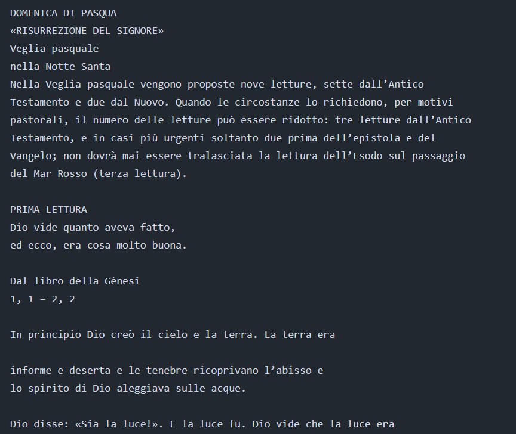
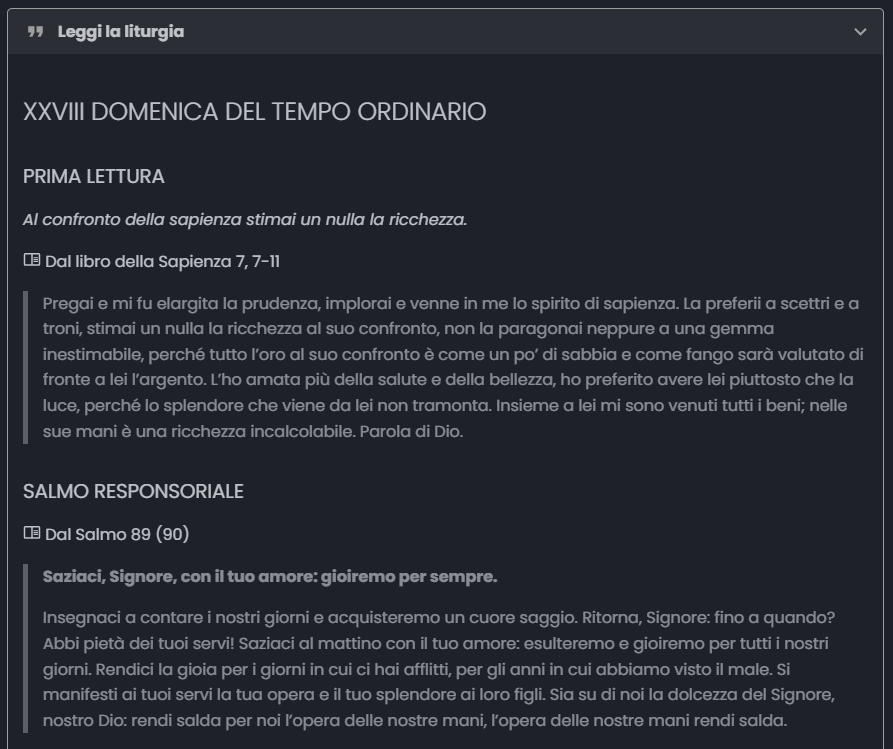

---
date:
  created: 2024-10-13
authors:
  - dennis
categories:
  - Novità
---

# Grandi novità per la funzione "Leggi la liturgia"

Abbiamo una novità che renderà la vostra esperienza su Hildegard.it ancora più immersiva e semplice! Siamo entusiasti di presentarvi il nuovo layout della sezione "Leggi la liturgia" – ora con un design rinnovato e una formattazione testuale perfetta per una lettura piacevole e ordinata. 🎉
<!-- more -->

## Nuova formattazione: più chiara, più accessibile

Con il nostro recente aggiornamento, il testo della liturgia è formattato con una maggiore cura dei dettagli. Questo vi permetterà di seguire le letture, i salmi e le preghiere in modo ancora più agevole. Ogni sezione della liturgia, dalla Prima Lettura al Vangelo, è ben distinta, con titoli evidenti e contenuti organizzati per facilitarne la comprensione.

### Prima/Dopo:
Abbiamo preparato un confronto visivo per mostrarvi il salto di qualità. Potete vedere chiaramente come la nuova versione della funzione si presenta ora rispetto a prima.

| **Prima**                               | **Dopo**                                |
|-----------------------------------------|-----------------------------------------|
|  |  |

### Che cosa cambia?
- **Testo più leggibile**: titoli e sezioni sono più evidenti, migliorando la navigazione.
- **Organizzazione intuitiva**: ogni parte della liturgia è separata chiaramente, rendendo la vostra esperienza online più fluida e naturale.
- **Design moderno**: lo stile ora si adatta perfettamente al resto del sito, offrendo una visione coerente e piacevole.

### Cosa puoi fare con la nuova funzione?
Ora, durante la celebrazione o nei momenti di preparazione, potrai seguire le letture con maggiore facilità. Non importa dove ti trovi: con la nuova versione mobile-friendly, "Leggi la liturgia" è sempre con te, pronta ad accompagnarti nella meditazione delle Scritture.

Non vediamo l'ora che proviate il nuovo design! Fateci sapere cosa ne pensate inviandoci una mail come indicato nella [sezione dei contatti](https://hildegard.it/progetto#contatti-e-segnalazioni) ;)
